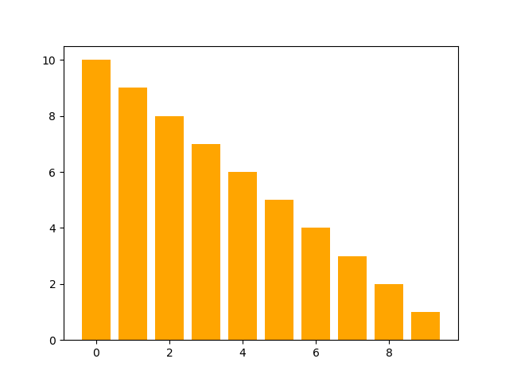

# SortingVisualizer

This project aims at visualizing sorting algorithms like Bubble Sort, Selection Sort, Quick Sort, Merge Sort, Heap Sort, Insertion Sort and generates a gif that captures the working of the algorithm and displays the total time taken. 

## Executing the script

The main script is sorting_algos.py and it can be executed with the following parameters:

--len : Length of the array

--algo : Algorithm to be used

        'bubble'    - Performs Bubble Sort
        
        'selection' - Performs Selection Sort
        
        'insertion' - Performs Insertion Sort
        
        'heap'      - Performs Heap Sort
        
        'quick'     - Performs Quick Sort
        
        'merge'     - Performs Merge Sort
        
        'all'       - Performs all the above mentioned sorts
        

